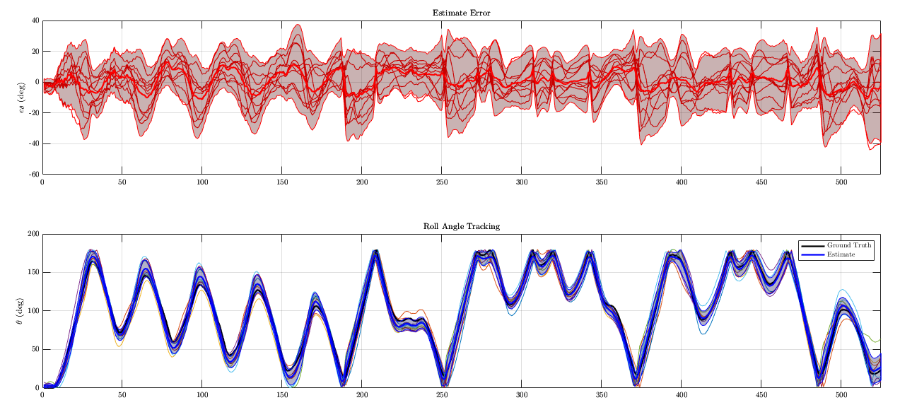

# Needle-Machine-Roll
This network predicts the roll angle of the needle tip given 5DOF sensor measurements and actuation input.

This repo is meant to be a basic demonstration of Data Prep, Network Training & Eval for this supervised learning problem.

## Data Prep
The sequences consist of input vectors ```X``` that contain the encoded 5DOF measurement and actuation.
The network is tasked with predicting a target vector ```Y``` that contains the encoded roll-angle missing from the tip state information.

The prepared dataset used for ISER2020 Experiments is contained in the ```data/``` folder. If you wish to modify the dataset input/output vectors, you can do so in ```prepare300ptDataset.m```.

## Training Network & Evaluation
This code runs in MATLAB with help from the Deep Learning Toolbox. 

The script ```trainAndEvaluate.m``` will load the dataset, partition it into 'training', 'validation', and 'test' datasets.
The 'training' dataset is then partitioned again ```k```-times to train an ensemble of ```k``` component networks. Because each network is trained on a different subset of the 'training' data, their predictions vary slightly from one another. This can be used to detect 'out-of-distribution' samples and encode a 'confidence' in the mean estimate.



*Note: The above is all offline analysis. To deploy this network online (under closed-loop control), the model should be deployed in C++. This can be done with Matlab Coder and the functionality can be implemented within a C++ class. Note that the network can be trained to predict at time ```t``` or for time ```t+1```, depending on how the observer is implemented in the control loop.

[ISER2020 Paper](https://research.vuse.vanderbilt.edu/MEDLab/sites/default/files/papers/Emerson2020_ISER.pdf)